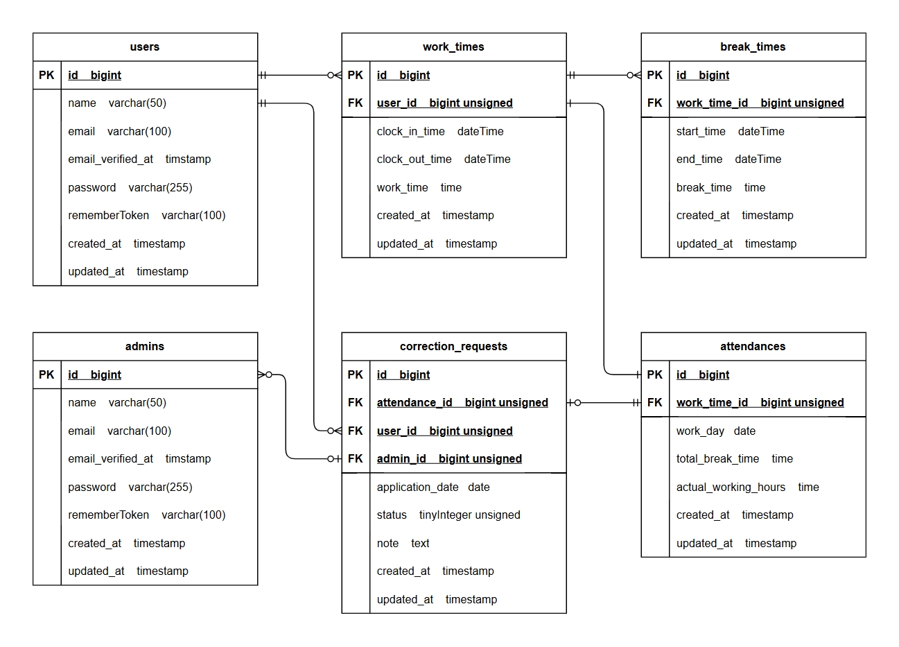

# attendance-management

## 環境構築

<p>Dockerビルド</p>
<ol>
  <li>git clone https://github.com/Takumi8888/attendance-management.git</li>
  <li>cd attendance-management</li>
  <li>git remote set-url origin git@github.com:Takumi8888/attendance-management.git</li>
  <li>docker-compose up -d --build</li>
  <li>sudo chmod -R 777 src/*</li>
</ol>

<p>Laravel環境構築</p>
<ol>
  <li>code .</li>
  <li>docker-compose exec php bash</li>
  <li>cp .env.example .env</li>
  <li>chmod 777 .env</li>
  <li>.envファイルの環境変数を変更</li>

```
APP_TIMEZONE=Asia/Tokyo

APP_LOCALE=ja
APP_FALLBACK_LOCALE=ja
APP_FAKER_LOCALE=ja_JP

DB_CONNECTION=mysql
DB_HOST=mysql
DB_PORT=3306
DB_DATABASE=laravel_db
DB_USERNAME=laravel_user
DB_PASSWORD=laravel_pass

MAIL_MAILER=smtp
MAIL_SCHEME=null
MAIL_HOST=mail
MAIL_PORT=1025
MAIL_USERNAME="info@example.com"
MAIL_PASSWORD=null
MAIL_FROM_ADDRESS="info@example.com"
MAIL_FROM_NAME="${APP_NAME}"
```

  <li>composer update</li>
  <li>php artisan key:generate</li>
  <li>php artisan migrate --seed</li>
</ol>

## 単体テスト
<p>下記手順にて単体テストを実施（phpコンテナ上にいる場合は、exitしてください）</p>

<p>MySQLコンテナ</p>

```
docker-compose exec mysql bash

mysql -u root -p
root

CREATE DATABASE demo_test;
SHOW DATABASES;

exit
exit
```

<p>PHPコンテナ</p>

```
docker-compose exec php bash

php artisan config:clear

vendor/bin/phpunit tests/Feature/Staff/RegisterTest.php
vendor/bin/phpunit tests/Feature/Staff/LoginTest.php
vendor/bin/phpunit tests/Feature/Staff/AttendanceRegisterTest.php
vendor/bin/phpunit tests/Feature/Staff/AttendanceTest.php
vendor/bin/phpunit tests/Feature/Staff/CorrectionRequestTest.php

vendor/bin/phpunit tests/Feature/Admin/LoginTest.php
vendor/bin/phpunit tests/Feature/Admin/AttendanceTest.php
vendor/bin/phpunit tests/Feature/Admin/CorrectionRequestTest.php
vendor/bin/phpunit tests/Feature/Admin/StaffTest.php
vendor/bin/phpunit tests/Feature/Admin/ApprovalTest.php
```

<p>注意：単体テストを実施する際は、1点ずつ実施してください。
<br/>Carbon::now()を実施する際、1秒のずれが生じる恐れがあります。（エラー例：下記参照）</p>

```
Failed asserting that a row in the table [break_times] matches the attributes {
    "work_time_id": 211,
    "start_time": "2025-04-05 18:03:53"
}.

Found similar results: [
    {
        "work_time_id": 211,
        "start_time": "2025-04-05 18:03:52"
    }
].
```

## 使用技術
<ul>
  <li>PHP 8.4.4</li>
  <li>Laravel 11.44.2</li>
  <li>jquery 3.7.1.min.js</li>
  <li>MySQL 8.0.26</li>
  <li>nginx 1.21.1</li>
</ul>

## URL
<ul>
  <li>開発環境：<a href="">http://localhost/</a></li>
  <li>phpMyAdmin：<a href="">http://localhost:8080/</a></li>
  <li>MailHog：<a href="">http://localhost:8025/</a></li>
</ul>

## テーブル仕様
### usersテーブル

| カラム名           | 型              | primary key | unique key | not null | foreign key |
| :---              | :---            | :---:       | :---:      | :---:    | :---        |
| id                | bigint unsigned | ○           |            | ○        |             |
| name              | varchar(50)     |             |            | ○        |             |
| email             | varchar(100)    |             | ○          | ○        |             |
| email_verified_at | timestamp       |             |            |          |             |
| password          | varchar(255)    |             |            | ○        |             |
| rememberToken     | varchar(100)    |             |            |          |             |
| created_at        | timestamp       |             |            |          |             |
| updated_at        | timestamp       |             |            |          |             |

### adminsテーブル

| カラム名           | 型              | primary key | unique key | not null | foreign key |
| :---              | :---            | :---:       | :---:      | :---:    | :---        |
| id                | bigint unsigned | ○           |            | ○        |             |
| name              | varchar(50)     |             |            | ○        |             |
| email             | varchar(100)    |             | ○          | ○        |             |
| email_verified_at | timestamp       |             |            |          |             |
| password          | varchar(255)    |             |            | ○        |             |
| rememberToken     | varchar(100)    |             |            |          |             |
| created_at        | timestamp       |             |            |          |             |
| updated_at        | timestamp       |             |            |          |             |

### work_timesテーブル

| カラム名           | 型              | primary key | unique key | not null | foreign key |
| :---              | :---            | :---:       | :---:      | :---:    | :---        |
| id                | bigint unsigned | ○           |            | ○        |             |
| user_id           | bigint unsigned |             |            | ○        | users(id)   |
| clock_in_time     | dateTime        |             |            | ○        |             |
| clock_out_time    | dateTime        |             |            |          |             |
| work_time         | time            |             |            |          |             |
| created_at        | timestamp       |             |            |          |             |
| updated_at        | timestamp       |             |            |          |             |

### break_timesテーブル

| カラム名           | 型              | primary key | unique key | not null | foreign key    |
| :---              | :---            | :---:       | :---:      | :---:    | :---           |
| id                | bigint unsigned | ○           |            | ○        |                |
| work_time_id      | bigint unsigned |             |            | ○        | work_times(id) |
| start_time        | dateTime        |             |            | ○        |                |
| end_time          | dateTime        |             |            |          |                |
| work_time         | time            |             |            |          |                |
| created_at        | timestamp       |             |            |          |                |
| updated_at        | timestamp       |             |            |          |                |

### attendancesテーブル

| カラム名              | 型              | primary key | unique key | not null | foreign key    |
| :---                 | :---            | :---:       | :---:      | :---:    | :---           |
| id                   | bigint unsigned | ○           |            | ○        |                |
| work_time_id         | bigint unsigned |             |            | ○        | work_times(id) |
| work_day             | date            |             |            | ○        |                |
| total_break_time     | time            |             |            |          |                |
| actual_working_hours | time            |             |            |          |                |
| created_at           | timestamp       |             |            |          |                |
| updated_at           | timestamp       |             |            |          |                |

### correction_requestsテーブル

| カラム名           | 型                   | primary key | unique key | not null | foreign key     |
| :---              | :---                 | :---:       | :---:      | :---:    | :---            |
| id                | bigint unsigned      | ○           |            | ○        |                 |
| attendance_id     | bigint unsigned      |             |            | ○        | attendances(id) |
| user_id           | bigint unsigned      |             |            | ○        | users(id)       |
| admin_id          | bigint unsigned      |             |            |          | admins(id)      |
| application_date  | date                 |             |            | ○        |                 |
| status            | tinyinteger unsigned |             |            | ○        |                 |
| note              | text                 |             |            | ○        |                 |
| created_at        | timestamp            |             |            |          |                 |
| updated_at        | timestamp            |             |            |          |                 |

## ER図


## テストアカウント
管理者<br/>
email: admin@coachtech.com<br/>
password: password
-------------------------
スタッフ<br/>
email: reina.n@coachtech.com<br/>
password: password
-------------------------
