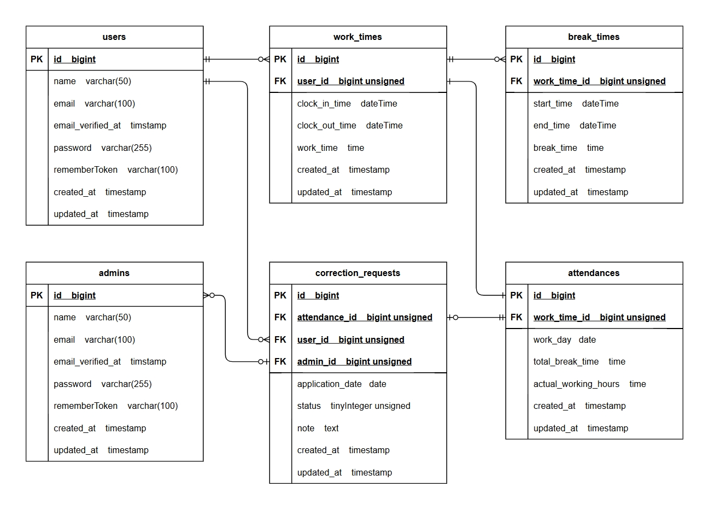

# お問い合わせフォーム

## 環境構築

<p>Dockerビルド</p>
<ol>
  <li>git clone https://github.com/Takumi8888/attendance-management.git</li>
  <li>cd attendance-management</li>
  <li>git remote set-url origin git@github.com:Takumi8888/attendance-management.git</li>
  <li>docker-compose up -d --build</li>
  <li>sudo chmod -R 777 src/*</li>
</ol>
<p>＊ MySQLは、OSによって起動しない場合があるのでそれぞれのPCに合わせて docker-compose.yml ファイルを編集してください。</p>

<p>Laravel環境構築</p>
<ol>
  <li>code .</li>
  <li>docker-compose exec php bash</li>
  <li>cp .env.example .env</li>
  <li>chmod 777 .env</li>
  <li>.envファイルの環境変数を変更</li>

```
APP_TIMEZONE=Asia/Tokyo
APP_LOCALE=ja
APP_FALLBACK_LOCALE=ja
APP_FAKER_LOCALE=ja_JP

DB_CONNECTION=mysql
DB_HOST=mysql
DB_PORT=3306
DB_DATABASE=laravel_db
DB_USERNAME=laravel_user
DB_PASSWORD=laravel_pass

MAIL_MAILER=smtp
MAIL_SCHEME=null
MAIL_HOST=mail
MAIL_PORT=1025
MAIL_USERNAME="info@example.com"
MAIL_PASSWORD=null
MAIL_FROM_ADDRESS="info@example.com"
MAIL_FROM_NAME="${APP_NAME}"
```

  <li>composer update</li>
  <li>php artisan key:generate</li>
  <li>php artisan migrate --seed</li>
</ol>

## 使用技術
<ul>
  <li>PHP 8.4.4</li>
  <li>Laravel 11.44.2</li>
  <li>jquery 3.7.1.min.js</li>
  <li>MySQL 8.0.26</li>
  <li>nginx 1.21.1</li>
</ul>

## URL
<ul>
  <li>開発環境：<a href="">http://localhost/</a></li>
  <li>phpMyAdmin：<a href="">http://localhost:8080/</a></li>
  <li>MailHog：<a href="">http://localhost:8025/</a></li>
</ul>

## ER図


## テストアカウント
管理者<br/>
email: admin@coachtech.com<br/>
password: password
-------------------------
スタッフ<br/>
email: reina.n@coachtech.com<br/>
password: password
-------------------------

## 連絡事項
<h3>運営側に確認済みの項目</h3>
<ul>
  <li>環境構築について</li>
  <p>質問：任意の環境で構築しても問題ないか？
  	<br/>回答：任意の環境構築で問題ありません。
  	<br/>対応：任意の環境で構築した。
  </p>

  <li>テーブル数について</li>
  <p>質問：テーブル数を10個以内に収める際、既存で作成するテーブルは含まないという認識で良いか？
  	<br/>　　　既存テーブルを削除すると動作しなくなる。
  	<br/>回答：動作しないのであれば、既存テーブルは含まず、新規作成したテーブルをカウントする。
  	<br/>対応：新規作成したテーブル数を10個以内に収める。
  </p>

  <li>管理者の登録画面について</li>
  <p>質問：管理者の登録画面がない
  	<br/>回答：管理者の会員登録は行わない。ダミーデータで作成すること。
  	<br/>対応：ダミーデータで対応した。
  </p>

  <li>勤怠詳細画面における休憩（追加入力分）について</li>
  <p>質問：休憩を2回以上とった場合、追加で入力フィールドを表示するとあるが、
	<br/>　　　figmaでは1回分の休憩でも追加の入力フィールドが確認でき、矛盾している。
  	<br/>回答：休憩回数分のレコードと追加で１つ分の入力フィールドを表示する。
  	<br/>対応：休憩回数に限らず、追加で1回分入力できるように実装した。
  </p>

  <li>FN022の機能要件について</li>
  <p>質問：「休憩入」ボタンは1日に何回でも押下できるとあるが、
  <br/>　　　「退勤は1日に1回だけ押下できる」が正しい表現であると思われる。
  	<br/>回答：要件ミス。正しくは「退勤は1日に一回だけ押下できる」。
  	<br/>対応：退勤は1日に一回だけ押下する仕様で実装した。
  </p>

  <li>FN038の機能要件について</li>
  <p>質問：「日付」「出勤・退勤」「休憩」「備考」の4項目を編集できるとあるが、
	<br/>　　　Figmaでは「出勤・退勤」「休憩」「備考」の3項目となっている。
  	<br/>回答：日付の更新はできない仕様にする。
  	<br/>対応：日付の更新はできない仕様にした。
  </p>

</ul>